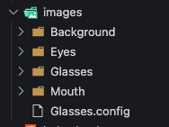
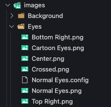
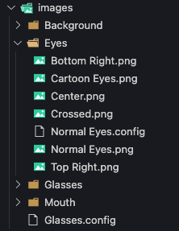
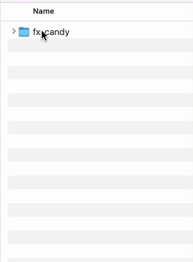
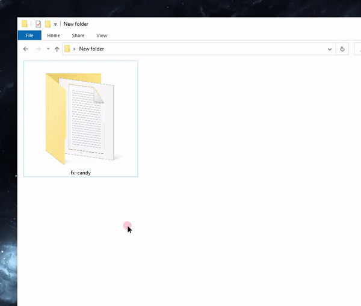

# 🍬 FX Candy 
A Candy Machine like setup and artwork generator for [fx(hash)](https://www.fxhash.xyz/).

#### Why
If you want to launch any sort of generative type artwork on most blockchains you first have to...
- Generate all your art and metadata.
- Build and wire up a server running a website with a "connect your wallet" flow and Candy Machine on the backend which handles distributing tokens.
- Once minted, apply and submit work and metadata to marketplaces of your chose.

[fx(hash)](https://www.fxhash.xyz/) allows for us to do a lot of these things all in one step and FX Candy helps you do so.

## 📦 Download
- [Download Blank Template]()
- [Download Template w/Examples]()

## 🤝 Getting Started

To ensure the highest quality, we recommend that your exported image files meet the following requirements.
- At least or close to 1080px by 1080px in size.
- Files are same size and aspect ratio.
- Images are all type `.png` if your project uses more than one attribute.
- Add image files to the `/images` folder in your FX Candy template.
- Organize art files by attribute similar to the example below.

Example Files            |  Example Images
:-------------------------:|:-------------------------:
 |  

## 🎨 Attributes
Attributes are the characteristics of an NFT defined by the artists such as `Background: Black` `Hair: Blonde` or `Headgear: Crown`.

FX Candy works by...
1. Picking a random image file from each attribute folder in the `/images` folder.
2. Saving the **folder name** and **file name** as the attribute name and value.
3. Merging the chosen attribute files together into one image resulting in the NFTs final image.

Names/Values            |  Images
:-------------------------:|:-------------------------:
 |  

## 🛠 Configuration
Suppose you want certain attributes to be chosen more often than others, or you don't want to rename an attribute value, this is where `.config` files come in.

To apply a configuration file, copy the `config_template.config` file and paste it next to the file/folder you want to configure. Replace "config_template" with the name of the file/folder you want to configure values as desired.

_            |  _   | _
:-------------------------:|:-------------------------:|:-------------------------:
 |   | 


#### Attribute Configuration
Configure attributes by adding `.config` files in the top level of the `/images` folder. Make sure everything before `.config` matches up with an attribute folder name.


| Option | Description |
| - | - |
| `name` | Rename the attribute to something other than the folder name associated with this config. |
| `chance` | A percentage chance this attribute will be used such as `25` for 25%. | After all defined chances have been choses or not chosen
| `order` | By default, layers are ordered alphabetically. You can define a specific order for your attributes using the order property. It is recommended that you define your base layer as `order=1` and go up from there and create additional `.config` files as needed.

**Example Attribute Config**
- 50% chance that the "Glasses" attribute (`/images/Glasses`) will be used.
- Rename the attribute from "Glasses" to "Eyewear".
- Order this as the 3rd layer when merging attributes together.

`/images/Glasses.config`
```bash
name=Eyewear
chance=50
order=3
```


#### Value Configuration
Configure attribute values by adding `.config` files inside of the attribute folders. Be sure everything before `.config` matches up with an attribute file (.png) in the same folder.


| Option | Description |
| - | - |
| `name` | Rename the value to something other than the file name associated with this config. |
| `chance` | A percentage chance this value will be used such as `25` for 25%. | After all defined chances have been choses or not chosen.
| `order` | In the case of values, order refers to the order in which rarity is calculated. If you set one attribute value to be `order=1` and it's chance is set to `25`, then the generator will first check if this should be included, and if not, randomly pick from the remaining values. If you define the `order` for multiple values, those will first run in order and if nothing has been chosen, pick one from the pile.

**Example Value Config**
- 50% chance that the "Glasses" attribute (`/images/Glasses`) will be used.
- Rename the attribute from "Glasses" to "Eyewear".
- Order this as the 3rd layer when merging attributes together.

`/images/Eyes/Normal Eyes.config`
```bash
name=Sexy Eyes
chance=50
order=3
```


## 👀 Preview
To preview your project, open the `index.html` in any modern web browser like Chrome or Safari. Each time you refresh the page, FX Candy will generate a new item. Preview often and refresh the page often as you are adding artwork.

## 🚀 Deploy to fx(hash)

### 📁 Compress It
In order to upload to [fx(hash)](https://www.fxhash.xyz/) the FX Candy project folder needs to be a `.zip`.

**Important:** Make sure your zip file doesn't exceed 15mb as mentioned by [fx(hash) mint guide](https://www.fxhash.xyz/articles/guide-mint-generative-token).

#### MacOS
1. Right click project folder
2. Click "Compress..."



#### Windows
1. Right click project folder
2. Hover "Send to"
3. Click "Compressed..."



### 📦 Upload To fx(hash)
Now that you have a `.zip`, you can upload it to [fx(hash)](https://www.fxhash.xyz/).

Make sure you have previewed your project both locally and in the [fx(hash)](https://www.fxhash.xyz/) sandbox before actually deploying.

- Sandbox: [fx(hash) Sandbox](https://www.fxhash.xyz/sandbox)
- Mint Guide: [fx(hash) Sandbox](https://www.fxhash.xyz/articles/guide-mint-generative-token)

#### Support
If you need help or want to chat, reach out in the [Snifty Creative Discord](https://discord.com/invite/ahstt6BwyS) and we'll be happy to help. 