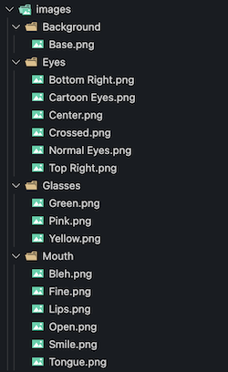
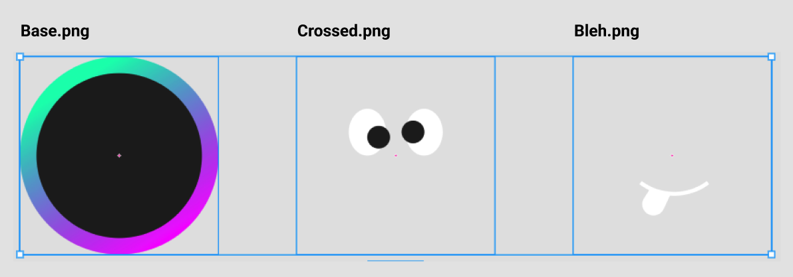
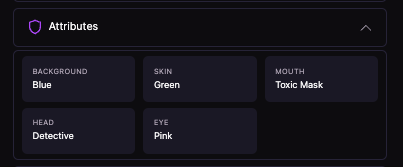
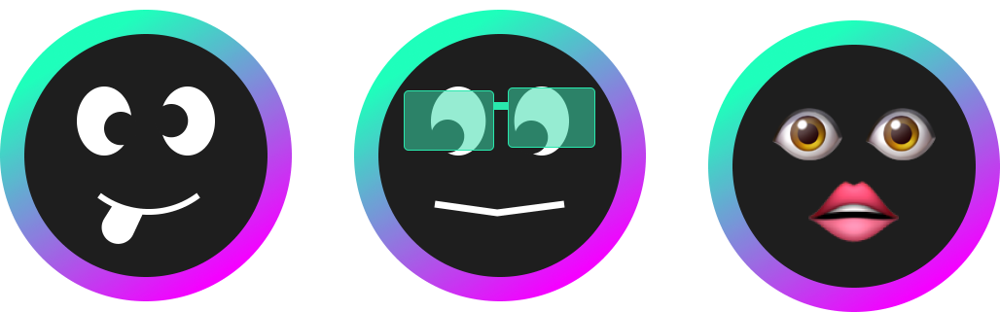

# 🍬 FX Candy 
A Candy Machine like setup and artwork generator for [fx(hash)](https://www.fxhash.xyz/).

#### Why
If you want to launch any sort of generative type artwork on most blockchains you first have to...
- Generate all your art and metadata.
- Build and wire up a server running a website with a "connect your wallet" flow and Candy Machine on the backend which handles distributing tokens.
- Once minted, apply and submit work and metadata to marketplaces of your chose.

[fx(hash)](https://www.fxhash.xyz/) allows for us to do a lot of these things all in one step and FX Candy helps you do so.

## 📦 Download
- [Download Template](https://github.com/snifty-repo/fx-candy/raw/master/fx-candy.zip)

## 🤝 Getting Started

To ensure the highest quality, we recommend that your exported image files meet the following requirements.
- At least or close to 1080px by 1080px in size.
- Image file names and folders DO NOT contain any spaces. If you need a space in a file/folder name, you can use "_" and it will be replaced with a space upon generation.
- Images are all type `.png` if your project uses more than one attribute.
- Add image files to the `/images` folder in your FX Candy template.
- Files are same size and aspect ratio.
- Organize art files by attribute similar to the example below.

Example Files            |  Example Images
:-------------------------:|:-------------------------:
 |  

## 🎨 Attributes
Attributes are the characteristics of an NFT defined by the artists such as `Background: Black` `Hair: Blonde` or `Headgear: Crown`.

FX Candy works by...
1. Picking a random image file from each attribute folder in the `/images` folder.
2. Saving the **folder name** and **file name** as the attribute name and value.
3. Merging the chosen attribute files together into one image resulting in the NFTs final image.

Names/Values            |  Images
:-------------------------:|:-------------------------:
 |  

## 🛠 Config
In order for FX Candy to know about any of your attribute files, you have to define them in `config.js`.

#### Structure
Add as many attribute objects as you wish inside of the `const fxCandyConfig = []` array with as many values as you wish. Just make sure they follow JavaScript Object patterns.

Does this sound confusing to you? Ping me on Discord and I'll build a config for ya. Also, I am planning on releasing a UI soon. 🤝

```javascript
const fxCandyConfig = [
    
    // This is an attribute,
    // Add as many of these blocks as you need. One for each folder.
    {
        // THis is a path to the attribute folder containing images.
        folder : "images/Background",

        // Optional: By default the name will be derived from the folder name. You can give specify a custom name to override the default.
        name : "",
        
        // These are all of the values for the above attribute.
        // Add a new value object for each file.
        values : [
            {
                // The .png file to look for inside of the attribute folder.
                file : "Base",

                // Optional: By default the name will be derived from the file name. You can give specify a custom name to override the default.
                name : "Black",
            }
        ]
    },
]
```

## 👀 Preview
**Dev Server**

The only way to accurately preview your project locally is to start a dev server. Follow the instructions below to start a local preview. Once running, each time you refresh the browser a new combination of attributes will be selected.

### VSCode Option (easier)
1. Download VSCode.
2. Download, extract/unzip, and open the template folder in VSCode.
3. Add the [Live Server](https://marketplace.visualstudio.com/items?itemName=ritwickdey.LiveServer) extension to VSCode if you don't already have it.
4. Once installed click the "Go Live" button in the bottom right of VSCode.


### CLI Option (easier...?)
1. [Download NodeJS (Current)](https://nodejs.org/en/)
2. Run the following inside the project folder:
```
npx nodemon --watch . -e md,css,html,js --exec 'npx sirv-cli --dev'
```
4. Open `http://localhost:8080` in your browser.

*Be sure to preview your work often and frequently refresh as you are adding artwork.*


## 🚀 Deploy to fx(hash)

### 📁 Compress It
In order to upload to [fx(hash)](https://www.fxhash.xyz/) the FX Candy project needs to be a `.zip`.

**Important:** Make sure your zip file doesn't exceed 15mb as mentioned by [fx(hash) mint guide](https://www.fxhash.xyz/articles/guide-mint-generative-token).

#### MacOS
1. Open your project folder in Finder.
2. Highlight all of your project files/folders.
3. Right click and select "Compress...".

You should get an `Archive.zip` which is what you upload to fx(hash).

### 📦 Upload To fx(hash)
Now that you have a `.zip`, you can upload it to [fx(hash)](https://www.fxhash.xyz/).

Make sure you have previewed your project both locally and in the [fx(hash)](https://www.fxhash.xyz/) sandbox before actually deploying.

- Sandbox: [fx(hash) Sandbox](https://www.fxhash.xyz/sandbox)
- Mint Guide: [fx(hash) Sandbox](https://www.fxhash.xyz/articles/guide-mint-generative-token)

#### Support
If you need help or want to chat, reach out in the [Snifty Creative Discord](https://discord.com/invite/ahstt6BwyS) and we'll be happy to help. 
